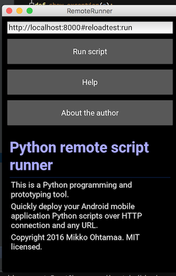
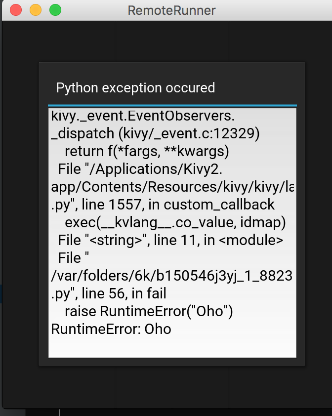
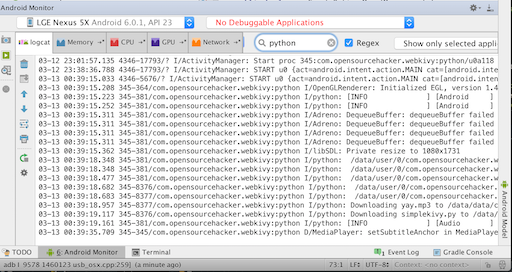

===========================================================
Webkivy: Remote live edit of Python applications on Android
===========================================================

.. contents:: :local:

Introduction
============

Webkivy is a tool for running `Python <https://python.org>`_ applications on an Android mobile over web. It is intended for quick prototyping, sharing your Python scripts with friends and learning Python development.

Live edit of source code is supported. Changed source code files are automatically copied to a mobile from any HTTP source. You do not need to copy new application files to your phone by hand - it's enough to hit *Run* button again and again. This web like development model makes it possible to prototype fast. Furthermore no development tools need to be installed lowering the barrier of entry for mobile application development.

The project is based on `Kivy <https://kivy.org/#home>`_ mobile application development framework. Using Python programming language makes dynamic compiling and execution possible, something that's `difficult with Android's default statically typed Java toolchain <http://stackoverflow.com/q/17538537/315168>`_.

Install
=======

* Android (`install from Google Play store <https://play.google.com/store/apps/details?id=com.opensourcehacker.webkivy>`_)

Features
========

* Run a Python application from a given URL link. Sharing your application with your friends is as easy as linking to its source code in web.

* "Just bunch of files" (JBOF) deployment model: use wi-fi, shared hosting, Apache, Amazon S3, gist.github.com, pasteboard or anything that serves HTTP to deploy your application.

* Live editing and reload of source code.

* Access to native Android Java APIs: sensors, Bluetooth, NFC, OpenGL, sound, others.

* Developer friendly Python exception handling with exception dialogs: no need to dig Android logs to see Python tracebacks.

* No additional tools required: write your code on a web editor or your favorite text editor.

Tutorial
========

Simple hello world
------------------

* See source code hosted on `gist.github.com <https://gist.github.com/miohtama/c623ff5e469cae15bfe6>`_

* Enter shortened URL to Webkivy application to run it: `http://bit.ly/webkivyhelloworld#run <http://bit.ly/webkivyhelloworld#run>`_

Example with audio resource
---------------------------

This tutorial link is preloaded to the application when you run it first time.

* See example index.html directory listing and Python entry point fragment `http://bit.ly/webkivytest#simplekivy:run <http://bit.ly/webkivytest#simplekivy:run>`_ (`Full link <https://cdn.rawgit.com/miohtama/webkivy/master/tests/test_data/webkivy.html#simplekivy:run>`_)

* `See example source code <https://github.com/miohtama/webkivy/blob/master/tests/test_data/simplekivy.py>`_

Usage
=====

Webkivy asks you for an URL from where to load your Python script.

* The URL can be a link to a single .py file

* The URL can be a link to a folder with an index.html file. This way multiple .py files and other application resources like images and sounds can be loaded.

* The URL must contain a fragment part telling the entry point. The entry point defines which Python module and function to call after the loading is complete.

* The URL may contain links to subfolders. These subfolders are also crawled and considered a Python submodule paths. Subfolders must come with their ``__init__.py`` file. Subfolder links must end with an ending slash (``/``) that is a default behavior of Python's simple HTTP server.

An example URL of running a Python application off from *gist.github.com*. This will load ``kivyhello.py`` from gist.github.com and run function ``main()``::

    https://gist.githubusercontent.com/miohtama/80391980c2e73b285cfe/raw/dd89a55497ba33a6014453d9bb7432ab424c01cf/kivyhello.py#main

An example URL of running a Python application from static web hosting with *index.html* support. This will crawl all files in the target, start ``simplekivy.py`` from ``run()`` functoin::

    http://bit.ly/webkivytest#simplekivy:run

The entry point function return `a Kivy screen object <https://kivy.org/docs/api-kivy.uix.screenmanager.html#kivy.uix.screenmanager.Screen>`_. Usually entry point is a module level function ``run()``. After entry point is called the Android application switches over to screen by given the entry point.

Delivering Python code to a phone
=================================

Compatible pastebins
--------------------

Write Python code online and execute in a phone through Webkivy.

* `ideone.com <http://ideone.com/ST7M6k>`_ (`example <http://ideone.com/ST7M6k>`_, `.py run link <http://ideone.com/plain/ST7M6k#run>`_)

* `labs.codecademy.com <http://labs.codecademy.com>`_ (`example <http://labs.codecademy.com/DQNv/1#:workspace>`_, `py run link <http://labs.codecademy.com/download/editor/DQNv/1#run>`_) - run link changes on each save, don't add ending lash in run link

* `gist.github.com <https://gist.github.com>`_ - it will give very long links, impossible to hand type and thus you need URL shortener too

Running Python code from your local computer over wi-fi
-------------------------------------------------------

* Assume you have created a Python file ``myscript.py`` based on the `example <https://github.com/miohtama/android-remote-python/blob/master/tests/test_data/simplekivy.py>`_.

* Make sure your phone and your computer are in same wi-fi network

* Figure out the internal IP address of your computer. Use the network manager of your operating system or following Python command::

     python -c "import socket ; print socket.gethostbyname(socket.gethostname())"

* Go to a folder where you have ``myscripy.py`` and start a Python built-in web server::

    python -m SimpleHTTPServer

* Enter URL to your computer. Replace ``999.999.999.999`` with your IP address

    http://999.999.999.999:8000/#myscript.py:run

* Hit *Run*

Entry point
===========

The Python entry point function is given in the URL fragment. It must return `a Kivy screen object <https://kivy.org/docs/api-kivy.uix.screenmanager.html#kivy.uix.screenmanager.Screen>`_. Usually entry point is a module level function ``run()``. After entry point is called the Kivy UI switches over to screen by given the entry point.

Example ``run`` entry point from ``http://localhost:8000#simplykivy:run``::

    from kivy.uix.screenmanager import Screen

    class HelloWorldScreen(Screen):

        def quit(self):
            # Bind this to your app UI if you want to return Webkivy main screen
            app = kivy.app.App.get_running_app()
            landing_screen = app.reset_landing_screen()
            self.manager.switch_to(landing_screen)

        def run():
            return HelloWorldScreen()

Exception handling
==================

By default all exceptions in Kivy main event loop are shown in a dialog:

If you have code that may raise exception outside Kivy main loop you can decorate it with ``webkivy.exception.catch_gracefully`` to get an error dialog. Otherwise you need to dig exception traceback from adb logs::

    from webkivy.exceptions catch_gracefully

    import android

    class MyScreen:

        def on_enter(self):
          android.activity.bind(on_new_intent=self.on_new_intent)

        @catch_gracefully()
        def on_new_intent(self, intent):

            action = intent.getAction()
            # Exception raised where here...

Installing packages
===================

Webkivy doesn't know about proper Python packaging (eggs, wheels, setup.py, etc.). However you can just symlink or copy related Python modules to your application as a subfolder. Subfolders are also crawled.

Alternatively you can rebuild Webkivy APK with libraries you need in ``buildozer.spec``

Namespacing
===========

All loaded Python files are put to the top level namespace. Absolute and relative imports should work between them. Thus, relative imports do not work on the top level of the application. If you want to use relative imports on your top level, just nest your deployed Python files in a dummy directory with ``__init__.py``.

Default libraries and permissions
=================================

The Python interpreter is Python 2.7. This will be upgraded as soon as `Buildozer toolchain <https://github.com/kivy/buildozer>`_ supports Python 3.

Default libraries include

* Kivy

* pyOpenSSL

* requests

* lxml

* pyjnius

* pygame

* futures

For the default available Android permissions see `buildozer.spec <https://github.com/miohtama/webkivy/blob/master/buildozer.spec#L69>`_. Please let me know if you wish any updates on these.

Viewing Android logs
====================

Android logs to a subsystem which is often referred as "adb logs". You will need to be able to read these lgos when a native Java API crash occurs. This is common when using Android APIs through pyjnius. Python cannot trap these errors and cannot display inline tracebacks for them.

The easiest way to view these logs is to

* `Set your phone to developer mode <http://wccftech.com/enable-developer-options-in-android-6-marshmallow>`_

* `Install Android SDK with Android Studio IDE <http://developer.android.com/sdk/index.html>`_

* Connect USB cable to your computer

* Use *Android monitor* in Android studio to view logs

Rebuilding Webkivy on Android
=============================

To build Webkivy APK you need to use Buildozer virtual machine image (Linux).

`Make sure your phone is in developer mode <http://wccftech.com/enable-developer-options-in-android-6-marshmallow/>`_. Connect your phone. Expose your phone to the VM by clicking the USB icon in the lower right corner of Virtualbox. `Make sure you have high quality USB cable <http://stackoverflow.com/questions/21296305/adb-commandline-hanging-during-install-phonegap>`_.

Build debug APK::

    buildozer android debug

Make sure VM sees your connected Android phone::

    /home/kivy/.buildozer/android/platform/android-sdk-20/platform-tools/adb devices

Deploying on a local Android phone using Buildozer (VM)::

    buildozer android debug deploy run

For the first deployment it will ask permission on phone screen. Accept it and rerun the command.

When your application crashes you can view adb logs::

    /home/kivy/.buildozer/android/platform/android-sdk-20/platform-tools/adb logcat

So start a Google Play release on Buildozer::

    # Make unsigned release
    buildozer android release

    # Copy APK over to host OS osing Virtualbox shared folder
    cp bin/Webkivy-0.1-release-unsigned.apk /mnt/code

Then on the host::

    # Create release key
    keytool -genkey -v -keystore ./Dropbox/android-keys/androidkey.keystore -alias androidkey -keyalg RSA -keysize 2048 -validity 10000

    # Sign release
    jarsigner -verbose -sigalg SHA1withRSA -digestalg SHA1 -keystore ~/Dropbox/android-keys/androidkey.keystore ~/code/Webkivy-0.1-release-unsigned.apk androidkey

    # ZIP alignment
    ~/Library/Android/sdk/build-tools/23.0.2/zipalign -v 4 ~/code/Webkivy-0.1-release-unsigned.apk ~/code/Webkivy.apk

Upload to Google Play developer console.

Developing Webkivy
==================

Please note that the project is not a proper distributed Python package, but a Kivy application.

Setup package in development mode::

    kivy -m pip install -e ".[dev, test]"

Running Kivy application locally::

    kivy -m webkivy.main

Go to ``test_data`` folder and there start a web server ``kivy -m http.server 8866``.
Then you can use URL `http://localhost:8866/#simplekivy:main <http://localhost:8866/#simplekivy:run>`_ for local Kivy app testing.

Run tests::

    kivy -m pytest tests

Run a single test::

    kivy -m pytest -k test_load_simple_module tests

Reading list
============

* `Kivy documentation <https://kivy.org/docs/gettingstarted/intro.html>`_

* `pyjnius documentation <https://pyjnius.readthedocs.org/en/latest/>`_

* An example of more complex Kivy application: https://github.com/tito/2048

Other
=====

Building reverse public tunnels with ngrok
------------------------------------------

If

* Your local computer doesn't have publicly exposed IP address

* Your WLAN devices cannot to connect each other due to enterprise wireless firewalling

You can use `ngrok <https://ngrok.com/>`_ to build a publicly exposed HTTP tunnel from Internet to your computer. Example how to expose Python http server running in port 8000::

    ngrok http 8000 -subdomain=myhorseapp

And then you can access your site at *myhorseapp.ngrok.io*.

Amazon S3 hosting
-----------------

For S3 deployment one needs to generate *index.html* directory listing files as Amazon doesn't do it for you.

Webkivy supplies a simple Bash script which can do index generation for you. Here is an example how to get directories prepared to for S3 upload and then upload them using Amazon aws tool.

Drop ``generate-index.bash``somewhere. First generate ``index.html`` files::

    # Run downloaded bash script
    ~/code/generate-index.bash

    Generated /Users/mikko/code/example.com/android/index.html
    Generated /Users/mikko/code/example.com/android/desfire/index.html

Then sync them to Amazon S3::

    aws s3 sync . s3://example.com

Install pyjnius on OSX
----------------------

You get functioning import and autocompletion in your editor when you install `pyjnius <https://pyjnius.readthedocs.org/en/latest/>`_ native modules.

Example::

    git clone git@github.com:kivy/pyjnius.git
    find /Applications|grep -i "jni.h"
    # Oracly y u so fun
    ln -s /Applications/Xcode.app/Contents/Developer/Platforms/MacOSX.platform/Developer/SDKs/MacOSX10.11.sdk/System/Library/Frameworks/JavaVM.framework/Versions/A/Headers/jni.h .
    /Applications/Kivy2.app/Contents/Resources/

    /Applications/Kivy2.app/Contents/Resources/venv/bin/python setup.py develop

`JNI headers installation on OSX <http://stackoverflow.com/questions/27498857/error-installing-pyjnius-jni-h-not-found-os-x-10-10-1>`_.

Contribute
==========

To discuss contact via IRC channel:

* Server: irc.freenode.net

* Port: 6667, 6697 (SSL only)

* Channel: #kivy

For bugs and issues open an issue at Github.

Author
======

Mikko Ohtamaa (`blog <https://opensourcehacker.com>`_, `Facebook <https://www.facebook.com/?q=#/pages/Open-Source-Hacker/181710458567630>`_, `Twitter <https://twitter.com/moo9000>`_)
